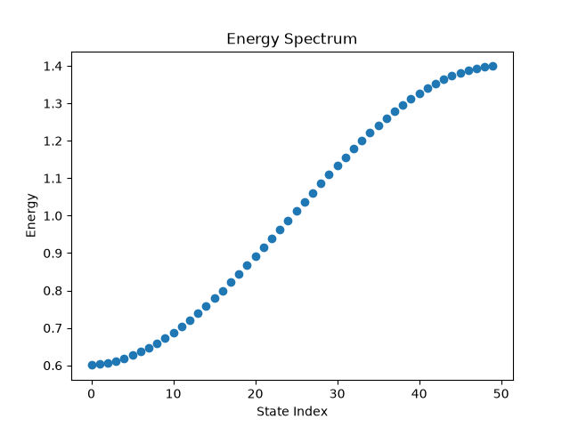
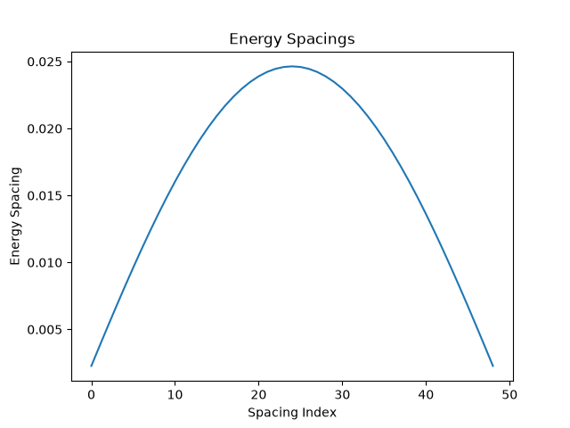

# Tight-Binding Spectrum Analyzer 

## Overview
This project simulates a one-dimensional chain of N atomic sites using a tight-binding model. The particle is assumed to be mostly localized on each site, but it can hop to neighboring sites through a coupling parameter V. The program constructs the Hamiltonian of the system and computes its eigenvalues and eigenvectors, which are then used to analyze properties such as the energy spectrum and the spacing between consecutive energy levels.

## Features
- Construct the Hamiltonian from the system size, on-site energy, and coupling parameter
- Compute eigenvalues and eigenvectors
- Plot the energy spectrum
- Plot the spacing between consecutive energy levels

## Installation 
Clone the repository and install the required dependencies:

```bash
python -m pip install -r requirements.txt
```

## Usage
Run the simulation from the directory containing the `tight_binding_analyzer` package:

```bash
python -m tight_binding_analyzer.main
```

## Tests
Run the test suite with:

```bash
python -m pytest
```
## Example output
H.shape: (50, 50)
First 5 Eigenvalues: [0.60075867 0.6030318  0.60681076 0.61208123 0.6188232 ]
Eigenvectors shape: (50, 50)
First 5 Energy Spacings: [0.00227313 0.00377896 0.00527047 0.00674197 0.00818791]

### Energy Spectrum


### Energy Spacings
